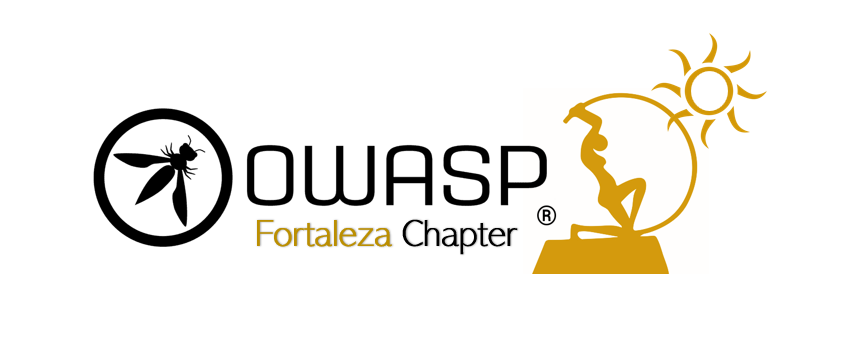

---

layout: col-sidebar
title: OWASP Fortaleza
tags: example-tag
region: South America

---



## Seja bem-vindo(a)!
Este é o capítulo OWASP em *Fortaleza/CE*.

O OWASP, sigla de Open Web Application Security Project, é uma organização internacional sem fins lucrativos destinada à transmissão de conhecimento e conscientização no que diz respeito à segurança de software, especialmente Web Security. Todos seus projetos, ferramentas, documentos, fóruns e capítulos são abertos à participação de qualquer pessoa interessada em melhorar a segurança de aplicações.

Fortaleza é a capital do estado do Ceará. Possuindo quase 3 milhões de habitantes (segundo a estimativa [IBGE 2019](https://cidades.ibge.gov.br/brasil/ce/fortaleza/panorama)), é a [quinta mais populosa do Brasil](https://agenciadenoticias.ibge.gov.br/agencia-sala-de-imprensa/2013-agencia-de-noticias/releases/25278-ibge-divulga-as-estimativas-da-populacao-dos-municipios-para-2019) e uma das mais importantes da Região Nordeste. Fortaleza é um hub fundamental de telecomunicações, pois concentra diversos [cabos submarinos internacionais](https://www.submarinecablemap.com/#/landing-point/fortaleza-brazil), que realizam a ligação do território brasileiro aos Estados Unidos, Europa e África. Por fim, a capital também demonstra sua importância por ser um [hub de aviação](https://www.ceara.gov.br/2019/07/25/governo-do-ceara-reunira-setores-do-turismo-em-evento-sobre-o-hub-aereo/), possuindo voos diretos para diversas cidades no exterior.

## Participação
Você é nosso(a) convidado(a) para participar de nossas reuniões. Como o capítulo acaba de ser criado, tanto o formato quanto o conteúdo do primeiro evento está sendo preparado. Vcoê pode contribuir dando sua opinião sobre como você gostaria que este evento fosse preenchendo o formulário abaixo:

* [Formulário para Evento Inaugural do Capítulo](https://forms.gle/FUR6VmT3mtDZbrqq9)

Os capítulos são liderados por líders locais, de acordo com o [Chapter Leader Handbook](/www-policy/rules-of-procedure/chapter-handbook). Contribuições financeiras devem ser feitas apenas de maneira online usando o botão autorizado para doação online. Para se tornar um APRESENTADOR em QUALQUER capítulo do OWASP no mundo, simplesmente revise o [speaker agreement](/www-policy/speaker-agreement), e contacte o líder do capítulo local com detalhes sobre qualquer projeto, pesquisa independente, ou tópico relacionado de segurança de software você gostaria de apresentar.

Todos são encorajados a participar em nossos [Projetos](/projects), [Capítulos Locais](/chapters), [Eventos](/events), [Grupos Online](https://groups.google.com/a/owasp.com/){:target='_blank'}, e [Canal Slack da Comunidade](https://owasp.slack.com/){:target='_blank'}. Encorajamos especialmente a diversidade em todas as nossas iniciativas. O OWASP é um local fantástico para apresentar sobre segurança de aplicações, para fazer networking e até mesmo construir sua reputação como um especialista. Sinta-se também convidado a [se tornar um membro](/membership) ou considere uma [doação](/donate) para suportar nosso trabalho constante.

<!-- Standard Chapter Page Template
This is an example of a Project or Chapter page.
Please change these items to indicate the actual information you wish to present. In addition to this information, the 'front-matter' above the text should be modified to reflect your actual information.  An explanation of each of the front-matter items is below:

{front matter for this file}

```
- layout: This is the layout used by project and chapter pages.  You should leave this value as col-sidebar
- title: This is the title of your project or chapter page, usually the name.  For example, OWASP Zed Attack Proxy or OWASP Baltimore
- tags: This is a space-delimited list of tags you associate with your project or chapter.  If you are using tabs, at least one of these tags should be unique in order to be used in the tabs files (an example tab is included in this repo) 
- region: This is the region you are in according to our data
```

{copy for this file (index.md)}
Replace the text above the commented area with your information in the format below:
```
## Welcome
Include some information here about your chapter

## Participation
The Open Web Application Security Project (OWASP) is a nonprofit foundation that works to improve the security of software. All of our projects ,tools, documents, forums, and chapters are free and open to anyone interested in improving application security. 

Chapters are led by local leaders in accordance with the [Chapter Leader Handbook](/www-policy/rules-of-procedure/chapter-handbook). Financial contributions should only be made online using the authorized online donation button. To be a SPEAKER at ANY OWASP Chapter in the world simply review the [speaker agreement](/www-policy/speaker-agreement) and then contact the local chapter leader with details of what OWASP Project, independent research, or related software security topic you would like to present.

Everyone is welcome and encouraged to participate in our [Projects](/projects), [Local Chapters](/chapters), [Events](/events), [Online Groups](https://groups.google.com/a/owasp.com/){:target='_blank'}, and [Community Slack Channel](https://owasp.slack.com/){:target='_blank'}. We especially encourage diversity in all our initiatives. OWASP is a fantastic place to learn about application security, to network, and even to build your reputation as an expert. We also encourage you to be [become a member](/membership) or consider a [donation](/donate) to support our ongoing work.

## Local News
- Meeting Location
- Everyone is welcome to join us at our chapter meetings.

```
{info.md}

This separate file is where you should place links to your Google Group and Meetup page. It will be automatically rendered in the column sidebar.

{leaders.md}

Another separate file that should simply include each leaders name with mailto link as a list. It will also be automatically rendered in the column sidebar.

-->
