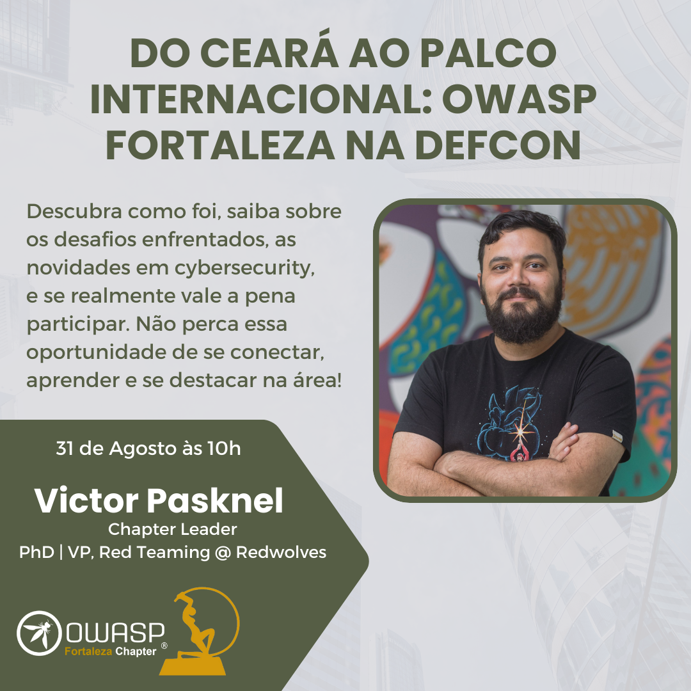
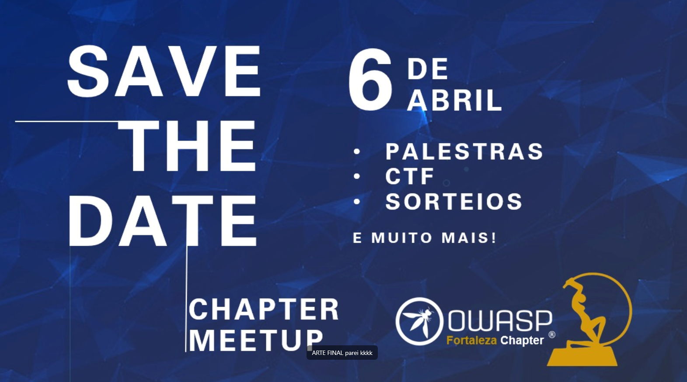
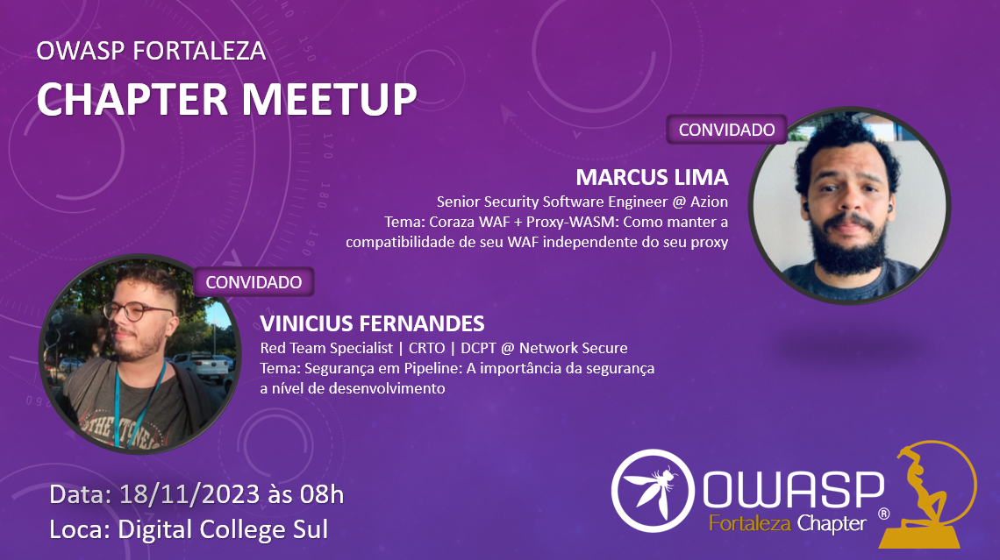
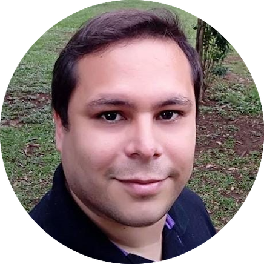
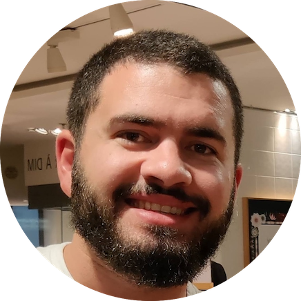

    
2024

    
    
    

    
2023

        

            
Reabertura Chapter Fortaleza 2023 - Encontro da Comunidade

            
        

    
2020

        

            
Sessão 1 - Encontro Inaugural - 25/04/2020

                <b>Data:</b> Sábado, dia 25/04/2020 
                
                <b>Link com a Gravação:</b> https://www.youtube.com/watch?v=9uVT0gLvdQg 

                <b>Programação:</b> 
                
                <b>Apresentação Disponível:</b> 
                <a href="assets/pdfs/Introducao_OWASP.pdf">Introdução à OWASP</a>
                
        

        

            
Sessão 2 - 27/06/2020

            
<strong>Data:</strong> Sábado, dia 27/06/2020

            
<strong>Link com a Gravação: <a href="https://www.youtube.com/watch?v=uLEWxhmN3hc">https://www.youtube.com/watch?v=uLEWxhmN3hc</a></strong>

            
<strong>Programação:</strong>

            <ul>
            <li>Abertura: 09:00 h</li>
            <li>NoSQL Injection (Ramon Martins): 09:15 h</li>
            <li>Queima Dockeral (Victor Pasknel): 10:15 h</li>
            <li>Apresentação a Confirmar: 11:15 h</li>
            </ul>
            
<strong>NoSQL Injection</strong>

            
Os sistemas de armazenamento de dados NoSQL tornaram-se muito populares devido à sua escalabilidade e facilidade de uso.

            
O surgimento de novos formatos de consulta torna irrelevantes as antigas técnicas de injeção de SQL, mas os bancos de dados NoSQL são imunes à injeção em geral? A resposta é não.

            
<strong>Ramon Martins</strong>

            

            
Pesquisador de Segurança da Informação no Instituto Atlântico

            
Graduado na Universidade Federal do Ceará - UFC no curso Ciência da Computação em 2018.

            
Mestrando no programa Mestrado e Doutorado em Ciência da Computação - MDCC na grande área Sistemas da Informação com foco em Blockchain

            
Pós-graduando MBA em Computação Forense no Instituto de Pós-graduação e Graduação - IPOG

            
RSI UFC - Criador do projeto RSI - Residência em Segurança da Informação: <a href="http://rsi.dc.ufc.br/">RSI</a>, projeto de extensão da UFC.

            
Entusiasta em Segurança da Informação, Big Data e IoT.

            

            
<strong>Queima Dockeral:  Ataques em Ambientes Docker</strong>

            
Containers estão cada vez mais presentes em ambientes corporativos, entretanto, estes elementos podem apresentar falhas de segurança que podem resultar no comprometimento da rede. Dado ao crescimento e importância do tema, esta palestra tem como objetivo apresentar diferentes técnicas para exploração e pós-exploração de containers em ambientes Docker.

            
<strong>Victor</strong>

            

            
Doutorando em Ciência da Computação pela Universidade de Fortaleza. Consultor de segurança na Morphus Segurança da Informação e professor universitário com ênfase em segurança da informação.

    

    

        
Sessão 3 - 12/12/2020

            <h2 id="sess-o-3">Sessão 3</h2>
            
<strong>Data:</strong> Sábado, dia 12/12/2020

            
<strong>Link para Inscrição:  <a href="https://www.sympla.com.br/owasp-fortaleza---reuniao-3__1062267">https://www.sympla.com.br/owasp-fortaleza---reuniao-3__1062267</a></strong>

            <h3 id="programa-o-">Programação:</h3>
            <ul>
            <li>Abertura e Boas Vindas: 10:00 h</li>
            <li>Aspectos Jurídicos para Uso da Blockchain (Emília Campos): 10:05 h</li>
            <li>Alavancando a Cibersegurança com Blockchain (Alex Monteiro): 10:50 h</li>
            <li>Blockchain - Uma Visão de Desenvolvimento (Weverton Medeiros): 11:35 h</li>
            <li>Bate-papo e tira-dúvidas: 12:15 h</li>
            </ul>
            <h3 id="aspectos-jur-dicos-para-uso-da-blockchain">Aspectos Jurídicos para Uso da Blockchain</h3>
            
<strong>Emília Campos</strong>

            

            
Advogada, palestrante e sócia da Malgueiro Campos Advocacia. Especialista em direito empresarial, digital e propriedade intelecutal. Membro da ANPPD.

            
Assessora clientes em negócios envolvendo criptomoedas, Token Sales e Blockchain.

            
É professora do MBA em Blockchain Development &amp; Technologies da Faculdade de Informática e Administração Paulista - FIAP.

            
Cursou o Executive MBA pela Business School ofSão Paulo, o LEEP na Thomas Jefferson School ofLaw e o MOOC em Digital Currencies and Blockchain Technology na University of Nicosia.

            
Ranqueada duas vezes pela publicação internacional Chambers Global e Latin America.

            
Autora do &quot;livro Criptomoedas e Blockchain - O Direito no Mundo Digital&quot;, Editora Lumen Juris.

            
Emília também possui um canal no Youtube, o Descomplicando o Direito.

            

            <h3 id="alavancando-a-ciberseguran-a-com-blockchain">Alavancando a Cibersegurança com Blockchain</h3>
            
<strong>Alex Monteiro</strong>

            

            
Desenvolvedor e Líder de Pesquisa e Inovação em Segurança da Informação no Instituto Atlântico - Ceará.

            
Mestrando em Ciência da Computação na Universidade Federal do Ceará.

            
Atua há 11 anos no desenvolvimento de soluções tecnológicas para diferentes áreas.

            
Atualmente, lidera a área de Segurança da Informação com especialidade em Blockchain, Proteção de Dados Pessoais e Análise de Vulnerabilidades.

            

            <h3 id="blockchain-uma-vis-o-de-desenvolvimento">Blockchain - Uma Visão de Desenvolvimento</h3>
            
<strong>Weverton Medeiros</strong>

            

            
Engenheiro de Software de Blockchain no Mastercard Labs - Irlanda.

            
Bacharel em Ciências da Computação com MBA em Gerenciamento de Projetos.

            
Possui mais de 12 anos de experiência  em desenvolvimento de software, com ênfase em Java.

    

