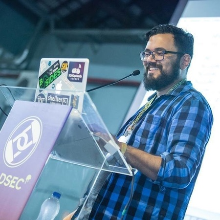

---

title: Sessao_2
displaytext: Encontro 2
layout:  null
tab: true
order: 3
tags: meeting-tag

---

## Sessão 2
**Data:** Sábado, dia 27/06/2020

**Link com a Gravação: [https://www.youtube.com/watch?v=uLEWxhmN3hc](https://www.youtube.com/watch?v=uLEWxhmN3hc)**

**Programação:**

* Abertura: 09:00 h
* NoSQL Injection (Ramon Martins): 09:15 h
* Queima Dockeral (Victor Pasknel): 10:15 h
* Apresentação a Confirmar: 11:15 h

**NoSQL Injection**

Os sistemas de armazenamento de dados NoSQL tornaram-se muito populares devido à sua escalabilidade e facilidade de uso.

O surgimento de novos formatos de consulta torna irrelevantes as antigas técnicas de injeção de SQL, mas os bancos de dados NoSQL são imunes à injeção em geral? A resposta é não.

**Ramon Martins**

Pesquisador de Segurança da Informação no Instituto Atlântico

Graduado na Universidade Federal do Ceará - UFC no curso Ciência da Computação em 2018.

Mestrando no programa Mestrado e Doutorado em Ciência da Computação - MDCC na grande área Sistemas da Informação com foco em Blockchain

Pós-graduando MBA em Computação Forense no Instituto de Pós-graduação e Graduação - IPOG

RSI UFC - Criador do projeto RSI - Residência em Segurança da Informação: <a href="http://rsi.dc.ufc.br/" target="_blankk">RSI</a>, projeto de extensão da UFC.

Entusiasta em Segurança da Informação, Big Data e IoT.

---

**Queima Dockeral:  Ataques em Ambientes Docker**

Containers estão cada vez mais presentes em ambientes corporativos, entretanto, estes elementos podem apresentar falhas de segurança que podem resultar no comprometimento da rede. Dado ao crescimento e importância do tema, esta palestra tem como objetivo apresentar diferentes técnicas para exploração e pós-exploração de containers em ambientes Docker.

**Victor Pasknel**

Doutorando em Ciência da Computação pela Universidade de Fortaleza. Consultor de segurança na Morphus Segurança da Informação e professor universitário com ênfase em segurança da informação.
